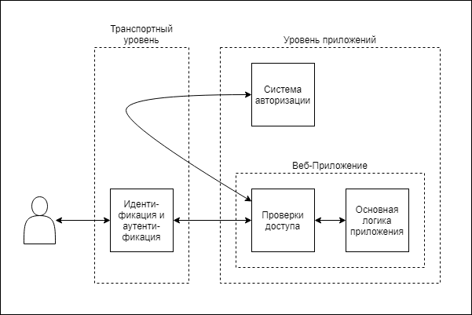
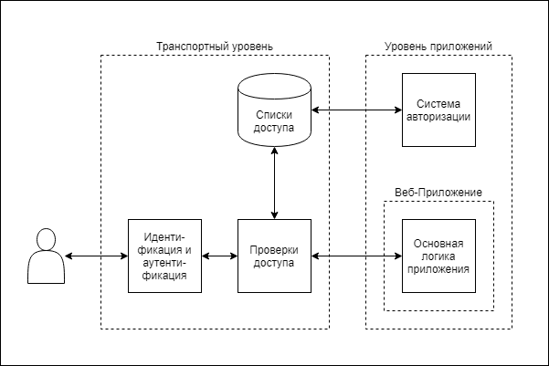
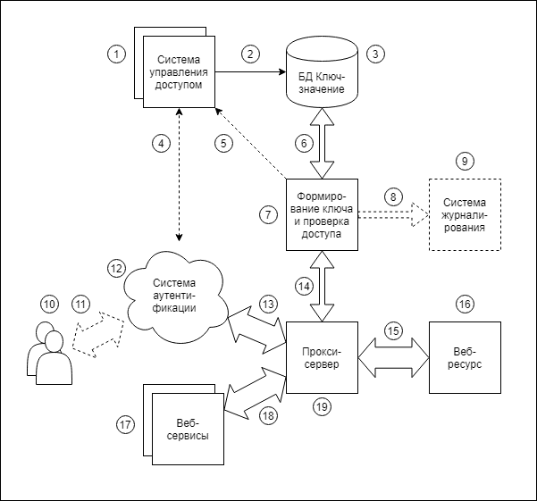

# Гибкая авторизация.

## Описание
В основной массе веб-приложений процедуры идентификации и авторизации пользователей 
вынесены из логики приложении, 
но авторизация пользователей (проверка их прав) происходит в самом приложении или во внедряемых в него библиотеках.
Суть предлагаемого метода полностью вынести логику авторизации из приложения 
на транспортный уровень (4-й уровень по OSI) и реализовать это уже имеющимися средствами. 
Для скоростной фильтрации контента на транспортном уровне можно использовать 
прокси-сервера, ограничивающие запросы по спискам доступа (ACL), а управлять содержимым этих списков можно с уровня приложений.
Таким образом, можно будет ограничивать доступ не только к веб-приложениям, но и к уже имеющемуся статическому содержимому веб-серверов.

Схема обычного подхода.

Схема предлагаемого подхода.

Рассмотрим преимущества и недостатки обоих подходов.
<table>
<tr><th> Обычный подход </th><th> Предлагаемый подход </th></tr>
<tr><td> Возможность реализации сложных алгоритмов авторизации. </td><td> Ограничения проверкой по списку доступа, но сколь угодно сложные алгоритмы его формирования.</td></tr>
<tr><td> Система авторизации - высоко-нагруженное высоко-критичное приложение </td><td> Снижение критичности и нагрузки на систему авторизации, в ней остаются только управляющие функции.</td></tr>
<tr><td> Функциональность авторизации зависит от выбранной модели </td><td> Независимость от исходной модели авторизации.</td></tr>
<tr><td> Риск возникновения уязвимостей при ошибках входе разработки приложения </td><td> При разработке приложения компоненты авторизации не изменяются, требуется только их настройка. При ошибках в настройках пользователь доступ не получит.</td></tr>
<tr><td> Риск уязвимостей, привнесенных во внешних библиотеках. </td><td> Внешние библиотеки не используются.</td></tr>
<tr><td> Риск падения приложения при повышении нагрузки. Подверженность DoS-атакам. Отсутствие ограничения трафика. </td><td> Фильтрация запросов происходит в другом, независимом от приложения процессе или сервере. Возможность применения специализированных алгоритмов защиты.</td></tr>
<tr><td> Сложность тестирования, для каждого типа пользователя приходится тестировать каждую операцию. </td><td> Операции тестируются единожды, не зависят от количества ролей или типов пользователей. Таблицы доступа тестируются отдельно, возможна автоматизация критериев их проверки.</td></tr>
<tr><td> Ограничения в стеке разработки приложений (Java, Spring). </td><td> Отсутствие ограничений, высокая повторяемость на разных компонентах, любые среды программирования.</td></tr>
</table>

## Достигаемые цели
* Упрощение и ускорение разработки и тестирования бизнес-приложений за счет отсутствия в них кода авторизации.
* Интеграция на транспортном уровне, а не на API приложений.
* Реализация системы авторизации для веб-приложений уже имеющимися средствами (не нужна разработка новых высоко-критичных приложений).
* Расширение стека применяемых технологий (возможность разработки приложений и на других средах разработки не только Java).
* Микросервисная реализация (любую часть системы можно заменить, не меняя других компонент) 
* Кросс-платформеность (возможность реализовать средствами для любой ОС и средах виртуализации)
* Масштабируемость нагрузки (от простых решений в целях разработки и тестирования до сложных высоко-нагруженных интернет-решений).
* Высокая интегрируемость (от авторизации статического содержимого сайтов до REST - протоколов и ранее написанных (Legacy) приложений) и совместимость с разными технологиями аутентификации (SSO, OAuth 2.0).
* Безопасность (сопротивляемость известным методам сетевых атак и взломов, актуальные алгоритмы шифрации).
* Авторизация межсервисных (межкомпонентных) запросов, возможность олицетворения запросов к сервисам. 
* Временная выдача прав и/или ограничение времени работы.
* Не инвазивная (бесконтактная) связь с системами мониторинга и сбора данных (цифровой след). Аудит критичных операций.

## Принцип работы

Функциональная схема процесса  

Запросы (11) пользователей (10) через систему аутентификации (12), как и запросы (18) от других веб-сервисов (17), поступают (13) на реверсивный прокси-сервер (19).
Из полученных в заголовке HTTP-запроса и из данных сертификата, под которым произошло соединение, формируется (7) ключ, который ищется в списке ключей (3).
При наличии такого ключа в списке принятый прокси-сервером запрос отправляется далее (15) на сервер приложений (16), а полученный от него ответ передается клиенту.
При отсутствии ключа в списке клиенту отправляется заранее заготовленный ответ.
Наличие необходимых ключей в списке обеспечивает (2) система управления доступом (1),
которая вычисляет их на основе полученных данных (4) по аналогичному алгоритму, применяемому при формировании (7).

При некоторых вариантах реализации при отсутствии ключа в списке ключей может инициироваться (5) процесс изменения списка по определенным критериям.

Запросы, поступающие на проверку доступа, при необходимости все или частично могут отправляться (8) в системы журналирования (9), фискализации и мониторинга .

### Система управления доступом

Системы управления доступом должна иметь следующие функции:

* Получение списков доступа из различных источников правовой информации.
Связь с уже существующими системами кадрового учета, других систем авторизации 
(построенным по разным моделям RBAC, ABAC), аутентификации и идентификации.

* Управление списками доступа (ACL).
    * Инициализация (первоначальная загрузка)
    * Актуализация (изменения состава пользователей и их прав)
    * Очистка 

Требования к системе управления предъявляются в зависимости от SLA. Ниже перечислены некоторые варианты:

* Инициализация - разово при старте системы. Актуализация - по мере вызова API системы аутентификации.
* Инициализация - по ночам. Актуализация - в течение суток не проводится
* Инициализация - по ночам. Актуализация - 1 раз в час
* Инициализация для пользователя - при первой попытке входа. Очистка по ночам.

## Компоненты

Ниже приведен список предполагаемых компонент, на которых возможна реализация построения системы.
* **Прокси-сервера:**
    * Nginx
    * Envoy (Istio)
    * HAProxy
* **БД Ключ-значение:**
    * Memcached
    * CouchBase
    * Tarantool
    * Redis
    * Aache Cassandra
* **Системы журналирования:**
    * syslog
    * rsyslog
    * syslog-ng
    * Splunk
    * ELK

## Ссылки 
* [Идентификация](https://ru.wikipedia.org/wiki/Идентификация) 
* [Аутентификация](https://ru.wikipedia.org/wiki/Аутентификация)
* [Авторизация](https://ru.wikipedia.org/wiki/Авторизация)
* [Сетевая модель OSI](https://ru.wikipedia.org/wiki/Сетевая_модель_OSI)
* [DoS-атака](https://ru.wikipedia.org/wiki/DoS-атака)
* [Уязвимость в Spring Framework версии 5.0.5](https://www.cvedetails.com/cve/CVE-2018-1258/)
* [Authorization Models: ACL, DAC, MAC, RBAC, ABAC](https://dinolai.com/notes/others/authorization-models-acl-dac-mac-rbac-abac.html)
* [ACL - список контроля доступа](https://ru.wikipedia.org/wiki/ACL)
* [RBAC - управление доступом на основе ролей](https://ru.wikipedia.org/wiki/Управление_доступом_на_основе_ролей)
* [ABAC - разграничение доступа на основе атрибутов](https://ru.wikipedia.org/wiki/Разграничение_доступа_на_основе_атрибутов)
* [Подходы к контролю доступа: RBAC vs. ABAC](https://habr.com/ru/company/custis/blog/248649/)
* [Аутентификация и авторизация в Istio / Хабр](https://habr.com/ru/company/flant/blog/443668/)