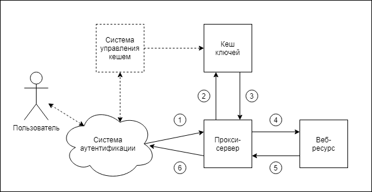

# Гибкая авторизация.

## Цель 
* Имеющимися средствами реализовать систему авторизации для веб-приложений.

## Требования
* Микросервисная реализация (любую часть системы можно заменить, не меняя других) 
* Кросс-платформеность (реализовать средствами для любой ОС (минимум Windows, Linux)

* Масштабируемость нагрузки (от минимальных: однопользовательских настольных (Desktop) решений 
(например, в целях разработки и тестирования, экономия тестового оборудования) 
до масштабов предприятий (Enterprise) и интернет-решений).
* Простая интегрируемость (встраиваемость вплоть до авторизации статического содержимого сайтов, набора простых документов).
Поддержка ранее написанных (Legacy) приложений.

* Перспективность (возможность дальнейшего развития функционала).

* Безопастность (сопротивляемость известным методам сетевых атак и взломов).
* Совместимость с разными технологиями аутентификации (SSO, OAuth 2.0)
* Современность (поддержка современных протоколов обмена данными (RESTful) .
* Обработка ошибок в терминах протокола.
* Авторизация межсервисных (межкомпонентных) запросов. 
* Временная выдача прав или ограничение времени работы.

* Аудит (логирование) критичных операций.
* Неинвазивная (бесконтактная) связь с системами мониторинга и сбора данных (цифровой след).

## Принцип работы

1. Выносим авторизацию из веб-приложения в интеграционный слой на уровне ОС.

2. Используем возможности выполнения прокси-сервером предварительного 
подзапроса (2) перед отправкой основного запроса (1) на сервер приложений (4).
Это встроенная возможность многих реверсивных прокси-серверов для реализации аутентификации.  
Данную функцию прокси-сервера применим для авторизации.   
Так как аутентификация проведена системами ранее и в исходном запросе (1)
уже существует информация об идентификаторе пользователя, то из параметров исходного HTTP-запроса 
формируется составной "ключ", например, строка "Субъект+Действие+Объект".
Здесь в виде субъекта может выступать логин пользователя в системе, имя, взятое из сертификата, или любой другой 
идентификатор.
Действием может быть, например, тип HTTP-запроса, а объектом - строка запроса или её часть.    
  
3. Далее используем веб-технологию - кеширование файлов страниц. 
Ищем "ключ", как будто файл в кеше. Есть файл - есть доступ, 
нет - в ответ отправляется заранее заготовленный на этот случай файл ответа и основной запрос не доходит 
до приложения. 

4. Для обеспечения безопасности закрываем приложение прокси-сервером. 
Все внешние входящие и иходящие соединения будет обеспечивать прокси-сервер. 
Связь между ним и приложением средствами ОС будем осуществлять только по 
внутренним сетевым интерфейсам, именованным каналам или файлам.   

5. При таком подходе прокси-сервер обладает всей необходимой информацией для ведения аудита действий проходящих 
через него. Можно на уровне прокси сервера настроить логирование необходимых действий с отправкой их в другие 
системы анализа (мониторинга, фискализации). Имея данные о расположении файлов логов приложения прокси-сервером
можно обеспечить к ним доступ для других сервисов.      

## Предполагаемые инструменты
* **Прокси-сервера:**
NginX, Envoy (Istio в Kubernetes кластере OpenShift)
* **Кеши:** 
Memcached, CouchBase, Tarantool, Redis, Aache Cassandra и другие NoSQL БД "ключ-значение".
* **Системы логирования:** syslog, log4j, slf4j

## Возникающие вопросы

**_Какого размера может быть размер ключа?_**

Размер ключевой инфрмации может быть практически любым. Например, по ней можно считать хеш-сумму 
и уже хеш-сумму использовать в качестве "ключа". Главное: такой же алгоритм нужно будет использовать при
заполнении кеша.

**_Какого размера может быть кеш?_** 

От кеша мы используем только информацию о наличии ключа, его содержимое не интересует и может быть пустым.
В любом случае занимаемый объём будет минимальным и тратится только на хранение значения ключей и дополнительной 
информации, обеспечивающей доступ (индексы).  
В самом простом случае кешем может быть файловая система с набором пустых файлов.
Для промышленных масштабов это может быть децентрализованная, отказоустойчивая и надёжная база данных "ключ-значение".
А если правовая информация каким-то образом алгоритмизируется,  роль кеша может исполнять любое другое веб-приложение,  
отвечающее на запросы ключа HTTP-статусами:
 "200" - в случае наличия доступа и 
 "404" - при его отсутствии.   

**_Прокси сервер, насколько это тяжеловесное решение?_**

Функцию подобного прокси-сервера может выполнять и часть кода клиентского приложения, которая встраивается 
в приложение в виде библиотеки. Отдельно разрабатываемые прокси-сервера обычно имеют более высокий уровень 
проработки защиты от сетевых атаках и оптимизации трафика чем библиотеки, предназначенные для встраивания. 
С точки зрения стабильности работы системы в целом отдельный процесс прокси сервера может "упасть", но работа 
основного приложения нарушена не будет. Это особенно важно для приложений, хранящих данные в оперативной памяти.
Например, при потере связи с прокси-сервером оно может корректно сохранить накопленные данные на диск и 
корректно завершить работу.    
Если судить по занимаемому месту на диске, например, мы пишем ПО на Java:
 * Размер файлов виртуальной машины Java 1.8: 360 МБ.    
 * Размер файлов библиотек для создания простого Spring boot приложения: 10 МБ.
 * Размер файла nginx: 3.6 МБ.
В этом случае объём файлов прокси-сервера 1% от объёма основного ПО.

**_Насколько эффективно делать ещё один авторизационный подзапрос на каждый запрос?_**

Размер подзапроса достаточно мал, в нём передается практически только ключ, в ответе нужен только HTTP-статус.
Такие запросы не содержат переменных частей и поэтому хорошо кешируются. Если в качестве интерфейса с кешем
будут использованы именованные каналы, это будет соизмеримо со скоростью доступа в память.  

**_На схеме приводится взаимодействие с пользователем, как будет происходить авторизация между сервисами?_**

В части ключа "Субъект" может быть использовано отличительное имя сертификата (Distinguished Name), 
таким образом, если у каждого сервиса или их группы будет свой сертификат, мы сможем контролировать доступ и для них.

**_Как использовать авторизацию в SOAP протоколе, в нём все типы запросов POST с неизменным URL_**

Протокол SOAP - самый неудобный формат обмена для авторизации такого типа. Авторизация возможна только на уровне
"Субъект имеет доступ или нет", без детализации по запросам, так как вся информация о действии и объекте расположена 
внутри тела сообщения. Для этого типа авторизации предпочтение следует отдавать 
протоколам, у которых вся информация, участвующая в формировании ключа, находится в заголовке HTTP-сообщения, 
например, в таких как REST.         

**_Каким способом ключи будут попадать в кеш?_**

Ключи можно генерировать скриптами по таблицам доступа из различных систем LDAP-каталогов, почтовых серверов,
кадровых баз предприятий. Заполнение ключей возможно при первом запросе от пользователя, а удаление - по истечении 
некоторого времени, таким образом можно экономить размер кеша. 
Для простых не нагруженных приложений роль кеша может выполнять любая СУБД или файловая система.
Для высоко-нагруженных систем - резидентные (in-memory database, IMDB) СУБД класса «ключ — значение», 
обеспечивающие элементарные возможности доступа по ключу и высокую производительность в условиях горизонтальной 
масштабируемости.    

**_Насколько такой подход перспективен?_**

При непрерывном обслуживании клиентов любая часть системы может быть заменена, не затрагивая другие, или расширена 
необходимым количеством экземпляров.
В системе нет привязки к определенным ОС или особенностям конкретного ПО. 
Всегда можно заменить компоненту на более современную, поменять алгоритмы генерации ключей, 
перейти на более защищенный протокол обмена. Это больше концепция, чем готовая система.        

**_Приведите пример для расширения возможностей Legacy-приложений._**

Рассмотрим возможности системы на основе приложения "Кредитный калькулятор". Это может быть простое одностраничное 
HTML-приложение. Данные для расчёта процентных ставок берутся из JSON-файла размещенного
"рядом" с основной страницей приложения.
Вдохнём вторую жизнь в приложение. При интеграции с системой авторизации файл с параметрами подменяем приложением 
или группой страниц,
форируемой на стороне сервера (SSI), в них заносим разные процентные ставки для различных групп пользователей.    
+ Таким способом получим возможность изменения процентных ставок: 
    - При интеграции в систему клиент-банк (от оборотов клиента)
    - При публикации приложения во внутренние сети обслуживаемых банком предприятий 
    (от участия их сотрудников в "зарплатных" проектах)
    - При публикации приложения в социальных сетях (от количества упоминаний банка в сообщениях и блогах) 
    - По времени (используя встроенные возможности БД/кешей). 
    Ставки могут заноситься заранее, а участвовать в расчётах они будут при истечении какого-то времени.       
+ Попытки расчетов могут собираться системой логирования запросов и использоваться в качестве триггера 
для расчетов предварительного одобрения кредита и контекстной рекламы.   
  
 
## Тезисы/дополнительные возможности
* Управлять кешем прав может одновременно несколько приложений
* Динамически - при первом запросе от пользователя, если таблицы его прав нет в кеше они туда загружаются.
* Ограничение времени сеанса пользователя
* Автопродление времени работы при выполнении критичных операций   
* снижение нагрузки на приложения за счет частичного кеширования контента
* развязка приложений через кеш 
* многие БД "ключ-значение" имеют встроенные механизмы времени хранения данных
* точки втстраивания аудита критичных действий для Legacy-приложений
* Вынос средств защиты из приложения - это возможность поддержки их всегда в актуальном состоянии. 
Не требует доработки приложений. Разделение зон ответственности между людьми при настройке серверов. 
+ Обработка сообщений об ошибках связи в формате передачи данных приложения. 
(например, кода приложение от сервера ожидает ответ в формате JSON, 
а ему приходит сообщение об ошибке тоже в формате JSON, а не HTML. 
Это упрощает и ускоряет разработку.     

---
 