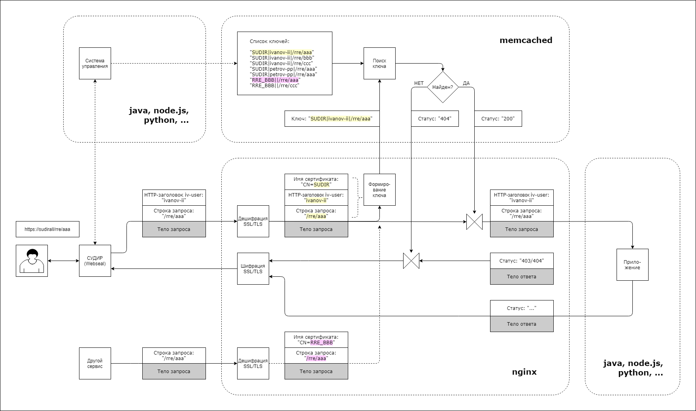

#  Вариант реализации Гибкой авторизации.

## Компоненты

* ОС - семейства Linux (Red Had, CentOS, Oracle Linux)
* Memcached - в виде БД ключ-значение для хранения списка ключей доступа (ACL).  
* Nginx - в качестве реверсивного прокси-сервера
* Система управления реализована в виде разовой загрузки ключей скриптом.  

### Почему Memcached?

+ поставляется в стандартном дистрибутиве linux
+ широко используется для кэширования страниц на разных веб-серверах 
+ простой протокол
+ много клиентских библиотек на разных языках 
+ много информации в интернете, хорошая документация

### Почему Nginx?

+ поставляется в стандартном дистрибутиве linux
+ много информации в интернете, хорошая документация, в том числе и на русском языке
+ хорошо известен и широко распространен
+ допускает гибкую настройку, позволяет менять настройки, не прерывая обслуживания
+ имеет модуль для взаимодействия с Memcached. 

## Схема взаимодействия выбраных компонент.



В прокси-сервере Nginx использована возможность выполнения предварительного
подзапроса перед отправкой основного запроса на сервер приложений.
Это встроенная возможность многих реверсивных прокси-серверов для реализации аутентификации.
Данная функция прокси-сервера использована для авторизации.

Так как аутентификация проведена системами ранее и в исходном запросе уже существует информация 
об идентификаторе пользователя в HTTP-заголовке `iv-user`,
из параметров исходного HTTP-запроса формируется составной ключ-строка "Источник+Субъект+Действие+Объект".
Элементы ключа будут разделены символом `|`, чтоб избежать их перекрытия.
Ключ будет строиться из следующих переменных "$ssl_client_s_dn|$http_iv_user|$http_iv_method|$uri"
* $ssl_client_s_dn - имя сертификата, таким способом будем определяется источник запросов.
* $http_iv_user - логин пользователя, предаваемый системой аутентификации.
* $http_iv_method - HTTP-метод (GET, POST, ...)(на схеме не показан).
* $uri - строка запроса.

Ищем "ключ", как будто файл в кеше. Есть файл - есть доступ, 
нет - в ответ отправляется заранее заготовленный на этот случай файл ответа, и основной запрос не доходит 
до приложения. 

Для обеспечения безопасности приложения
все внешние входящие и иходящие соединения будет обеспечивать прокси-сервер. 
Связь между ним и приложением будет осуществляться средствами ОС только по 
внутренним сетевым интерфейсам или именованным каналам.   
При таком подходе прокси-сервер обладает всей необходимой информацией для ведения 
аудита всех запросов, проходящих через него.
Можно на уровне прокси-сервера настроить логирование необходимых действий с отправкой их в другие 
системы анализа (мониторинга, фискализации). Имея данные о расположении файлов логов приложения, прокси-сервером
можно обеспечить к ним доступ для других сервисов.      

## Установка и настройка компонент

### Установка компонент
```
yum install -y memcached nginx
systemctl enable memcached nginx
setsebool httpd_can_network_memcache on
systemctl start memcached nginx
```

### Настройка Nginx
Пример файла настроек
```
server {
    listen  443 ssl;

    ssl_certificate        /etc/nginx/server.pem;
    ssl_certificate_key    /etc/nginx/server.key.pem;
    ssl_client_certificate /etc/nginx/client.pem;
    ssl_verify_client             optional;
    ssl_verify_depth              3;
 
    location /auth  {
        internal;
        set $memcached_key "$ssl_client_s_dn|$http_iv_user|$http_iv_method|$uri";
        memcached_pass 127.0.0.1:11211;
        error_page 404 502 504 = @nokey;
    }
    location @nokey {
        return 404 "Uncached: $memcached_key";
    }

    location / {
        auth_request /auth;
        proxy_pass   http://127.0.0.1:8080;
    }
}
```

### Загрузка данных
Загрузка может быть произведена скриптом для javascript-движка Nashorn, встроенного в Java 8.
Скрипт загрузки одного ключа в Memceched (mch.js):
```
var arg = { host: "127.0.0.1", port:"11211", x:"0", value:"1",
    cert:"CN=MyService1", user:"user", method:"GET", uri:"/aaa" };

for (var i=0;i<arguments.length;i++) {
    arg[arguments[i]] = arguments[++i];
}

var XMemcachedClient = Java.type("net.rubyeye.xmemcached.XMemcachedClient");
var mc = new XMemcachedClient(arg.host, parseInt(arg.port));
mc.set(arg.cert+"|"+arg.user+"|"+arg.method+"|"+arg.uri, parseInt(arg.x), arg.value);
```
Для запуска скрипта понадобятся следующие библиотеки: 
* [xmemcached.jar](https://repo1.maven.org/maven2/com/googlecode/xmemcached/xmemcached/2.4.6/xmemcached-2.4.6.jar)
* [slf4j_api.jar](https://repo1.maven.org/maven2/org/slf4j/slf4j-api/1.7.5/slf4j-api-1.7.5.jar)
* [slf4j_impl.jar](https://repo1.maven.org/maven2/org/slf4j/slf4j-api/1.7.5/slf4j-simple-1.7.5.jar)

Команда вызова скрипта
```
jjs -J-Djava.class.path=.:./xmemcached.jar:./slf4j_impl.jar:./slf4j_api.jar ./mch.js user ivanov-ii method GET uri /aaa
```
## Ссылки
* [Memcached](https://ru.bmstu.wiki/Memcached)
* [Модуль ngx_http_memcached_module](https://nginx.org/ru/docs/http/ngx_http_memcached_module.html)
* [Nginx cache: всё новое — хорошо забытое старое](https://habr.com/ru/post/428127/)
* [Установка и защита Memcached в CentOS 7](https://www.8host.com/blog/ustanovka-i-zashhita-memcached-v-centos-7/)
* [Java 8 Nashorn Tutorial](https://winterbe.com/posts/2014/04/05/java8-nashorn-tutorial/)
* [Глава 6. Аутентификация - Книга рецептов NGINX](http://onreader.mdl.ru/NGINXCookbook/content/Ch06.html)